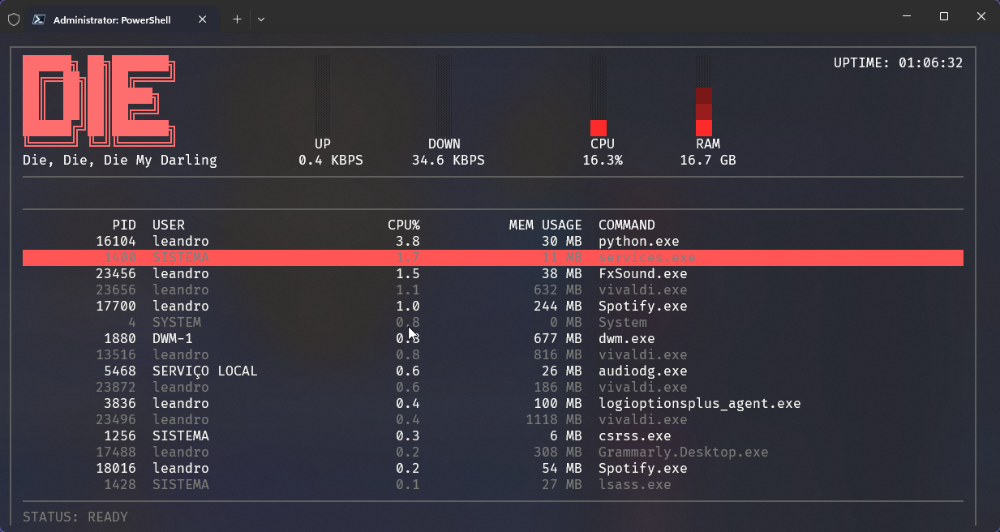

# 💀 die-cli — process exterminator (Windows)

`die-cli` is a Windows CLI/TUI inspired by *htop*, built to **kill processes fast and brutally**.

No moral judgement. No safety rails. No “are you sure?”.  
Press **K**: the process is **dead**. Press **T**: the whole tree gets **erased**. 😈

---

## What is this?
`die-cli` is a terminal-first process exterminator for Windows.  
Think *htop vibes*, but focused on one thing:

> **Ending processes. Immediately.**

---

## 🖥️ **See it In Action!**


https://github.com/user-attachments/assets/f1f384d2-f39a-4486-9e78-3fa5144b2195


---

## ⚠️ DANGEROUS BY DESIGN
This is not a “friendly” tool.  
It’s for operators who already have permissions… and accept consequences.

If you’re looking for a tool that protects you from yourself — congrats, this is not it. 💀

---

## Why the name?
Because this is basically my Windows-flavored tribute to the Linux **`kill`** command.

- `kill` → polite suggestion  
- `kill -9` → the grim reaper  
- `die-cli` → *“I’m not asking.”*

---

## 🌀 100% Vibe Coding (cope and seethe)
Yes, this project was built with pure **vibe coding** energy.

If you have something against vibe coding, that's fine — just know that in my headcanon even the **Godfather Linus Torvalds** has shipped stuff that came straight from the vibe dimension.

Don’t believe me? Here’s the “proof” (or at least the funniest exhibit A):  
https://github.com/torvalds/AudioNoise

**Where’s your god now?** 😈

---

## 🥷 Who this is for
For you who **live in the terminal**, dodge the mouse like it’s lava, and think a trackpad is just a *stress test* for your patience.

If your natural habitat is:
- PowerShell / cmd / Windows Terminal
- SSH sessions at 2AM
- keyboard shortcuts burned into muscle memory

…welcome home, terminal ninja. 🥷⌨️  
(If the mouse is your main weapon, you may feel physical discomfort here. That’s normal.)

---

## ✅ What it is (and what it isn’t)

### ✅ It is
- **Fast and responsive** (htop-like input feel)
- **Pure ASCII** (no Unicode box drawing / no weird glyphs / no terminal drama)
- Works on:
  - Windows 11
  - Windows Server (GUI)
  - Windows Server Core (terminal only)
- **No confirmations**
- **No dry-run**
- **No safe mode**
- **Permadeath**, with one tiny technicality:
  - The process stays dead **until something restarts it**  
    *(service manager, watchdog, scheduled task, or you resurrecting it on purpose)*

### ❌ It is not
- A pretty Task Manager
- A “safe for end users” support tool
- A tool designed to protect you from yourself

---

## ☠️ Warning (the painfully honest version)
By using `die-cli`, you accept that:

- You **understand** what killing processes means on Windows.
- You **accept** that terminating the wrong thing can break apps, services, sessions, and your day.
- `die-cli` **does not ask**, **does not confirm**, **does not forgive**.
- If you kill something important, it might not come back  
  *(unless it’s auto-respawned or you manually restart the service)*.
- If you kill a critical service in production and take down something expensive…  
  **you may receive a friendly invitation to HR.** 🫡💼

**No moral judgement. Just execution.**

---

## 🎮 Keybindings
- `↑ / ↓` — navigate  
- `K` — **kill** selected process (no confirmation)
- `T` — **kill tree** (parent + all children recursively, children first)
- `/` — filter by name
- `R` — manual refresh
- `Q` — quit

Bottom bar shows `STATUS` for your most recent act of violence.

---

## 🧨 Admin / Elevation
**Run as Administrator.**  
Some processes require elevation to terminate — without it, your “process exterminator” becomes a **strongly-worded request generator**.
=======
## CLI flags

- `die-cli --version` / `-v` prints the version and exits
- `die-cli --help` / `-h` prints usage and exits

Admin is required to run the full TUI and to terminate protected processes.

---

## 📦 Requirements


If elevation is denied/cancelled, die-cli will not pretend it can help. It will simply… not.

If you want a quick “runas” shortcut:
- Open an elevated terminal (Admin)
- run `die-cli`

---

## 📦 Requirements (dev)
- **Python 3.12+**
- `psutil`
- `windows-curses` (required on Windows)

Note: die-cli auto-elevates to admin; if UAC is denied, it exits with "RUN AS ADMIN OR GO HOME".
Tip: to keep the same terminal window, install `gsudo` and die-cli will relaunch through it.

---

## 🚀 Run (dev)
Install dependencies:

```powershell
py -m pip install -r requirements.txt
```

Then run:
```
py main.py
```

## 📦 Install (release)
**From GitHub Releases (portable)**

Download the `.zip`

Extract anywhere

Run `die-cli.exe`

## From Winget (after PR is merged)
```
winget install --id leandrofariasldf.die-cli
```

## License
**MIT**

**For my FOSS Fellas**
